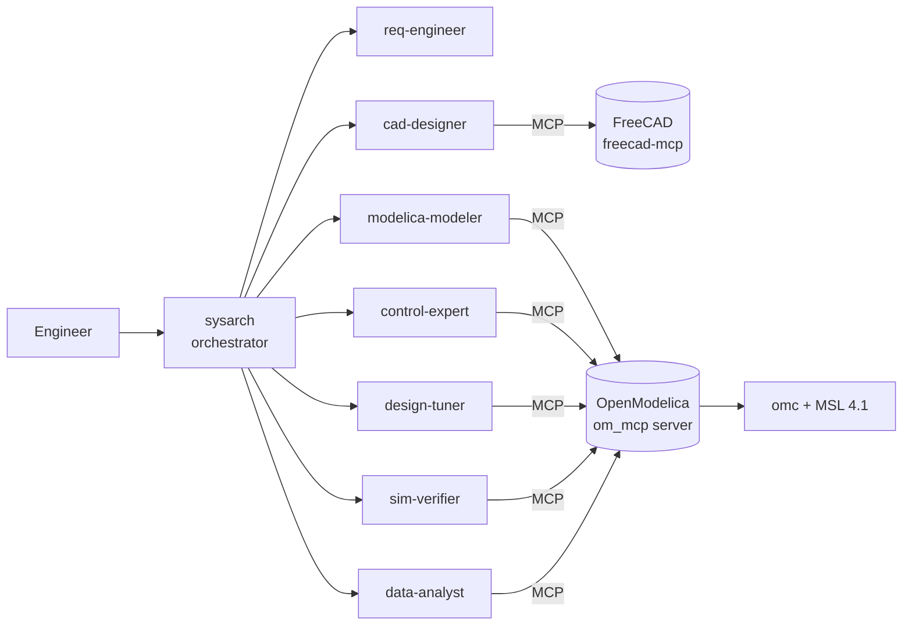
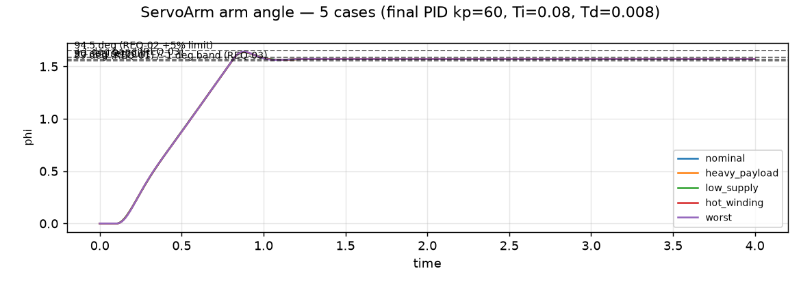
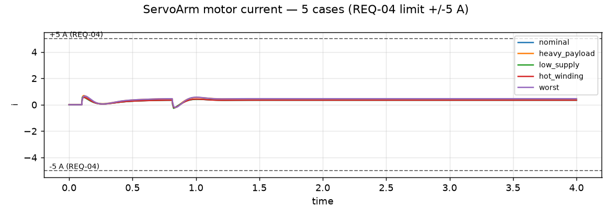

# agentic-sysmodel

**A multi-agent workflow that turns an engineering need into a verified physical system model**: requirements → architecture → CAD (FreeCAD) → acausal Modelica model (OpenModelica) → simulation → requirement-based verification → design sizing.

It runs in [opencode](https://opencode.ai) with DeepSeek models for prototyping, and every model choice lives in one config file. The first flagship example is the **sizing and verification of a nose-landing-gear retraction actuator**.


---

## Why this exists
LLMs can write Modelica code that *compiles* and still violates the physics or the requirements. This project wraps the LLMs in an engineering process:

- **Requirements drive verification.** Every REQ maps to a model variable, a machine-checkable criterion and edge cases (cold fluid, degraded pump, …).
- **Independent verification.** The verifier agent can't edit models. It runs cases and issues PASS/FAIL with evidence from tool calls only.
- **Component-first, engineer-readable models.** Standard-library components are wired with `connect()` and laid out for the OMEdit diagram. A `diagram_check` gate rejects equation-only "code models".
- **Deterministic numbers.** Measurements, margins, plots and exports come from tested tools, not from the LLM.

## Architecture



| Agent | Role | Tools |
|---|---|---|
| `sysarch` (primary) | plans, delegates, keeps requirement→evidence traceability | library search |
| `req-engineer` | measurable requirements + verification cases | files |
| `cad-designer` | FreeCAD geometry → mass properties and joint frames (SI) | FreeCAD MCP |
| `modelica-modeler` | component-based Modelica models | check, simulate, library search, class source, diagram check |
| `control-expert` | controllers, sequencing logic, linearization and margins | linearize, frequency analysis, measure |
| `design-tuner` | parameter sizing against requirements | simulate with overrides, verify |
| `sim-verifier` | independent V&V report | simulate, verify, measure, plot, export |
| `data-analyst` | measurements, case tables, plots, CSV/Excel | measure, compare, plot, export |

### OpenModelica MCP server (`tools/om_mcp`, 19 tools)
| Group | Tools |
|---|---|
| Build and run | `check`, `simulate` (run-time parameter overrides, tagged cases), `describe_class` |
| Library-first | `search_library`, `list_examples`, `get_class_source`, `diagram_check` |
| CAD → Modelica | `cad_body_parameters` (mass properties rotated into the model frame), `cad_import_shape` (STL → ASCII, metres, frame_a, for 3D animation) |
| Results | `read_results`, `list_variables`, `time_to_reach`, `verify` |
| Analysis | `measure` (rise/settling/overshoot/…), `compare_cases`, `plot`, `export_data` (CSV/XLSX) |
| Control | `linearize` (A,B,C,D), `frequency_analysis` (poles, GM/PM, bandwidth, Bode) |

Every analysis tool is checked against analytic results in `tools/om_mcp/selftest_*.py`.

### Skills (`.opencode/skills/`)
Modelica language basics for model-based-design engineers, diagram layout, an MSL library map, MultiBody, hydraulic actuators, electrical drives, control design, debugging, simulation settings, FreeCAD→Modelica handoff, requirements and verification, and skill authoring. They are backed by a generated knowledge base (`tools/knowledge/`) built from the MSL User's Guides, the OpenModelica User's Guide and the Modelica Language Specification.

## Example: ServoArm, the full chain verified end to end

A deliberately small system that still exercises every stage of the pipeline and the tricky parts of OpenModelica integration.

**System.** A 24 V DC motor (R = 2 Ω, L = 1 mH, k = 0.05 N·m/A) drives an aluminium arm (300 × 30 × 10 mm, Al 6061, Ø8 mm pivot hole) through a 50:1 gearbox, in a vertical plane. The arm carries a 0.20 kg tip payload. It starts hanging down and must swing to horizontal (90°) and hold there against gravity.

**What the agents did**

| Stage | Agent | Output |
|---|---|---|
| Requirements | `req-engineer` | 6 measurable REQs × 5 cases → [`requirements.yaml`](Example/ServoArm/Requirements/requirements.yaml) |
| Architecture | `sysarch` | domains, interfaces, MSL components → [`architecture.md`](Example/ServoArm/architecture.md) |
| CAD | `cad-designer` | FreeCAD part, mass properties (m = 0.2416 kg), STL → [`CAD/`](Example/ServoArm/CAD) |
| Plant model | `modelica-modeler` | MSL components only: `RotationalEMF`, `Resistor`, `Inductor`, `IdealGear`, `Inertia`, MultiBody `Revolute`/`BodyShape`/`PointMass` → [`package.mo`](Example/ServoArm/OpenModelica/ServoArm/package.mo) |
| Control | `control-expert` | smooth reference + PID with anti-windup and ±Vsupply limit; linearized loop-cut model for margins → [`control_design.md`](Example/ServoArm/Results/control_design.md) |
| Verification | `sim-verifier` | 5 cases × REQ matrix, plots, xlsx → [`verification_report.md`](Example/ServoArm/Results/verification_report.md) |
| Analysis | `data-analyst` | cross-case metrics → [`comparison_table.md`](Example/ServoArm/Results/comparison_table.md) |

**Result: VERIFIED.** All 25 simulation cells (REQ-01…05 × 5 cases) PASS, and REQ-06 passes for the nominal and worst cases.

| Requirement | Limit | Nominal | Worst case (0.3 kg, 20 V, R +30 %) |
|---|---|---|---|
| REQ-01 reach 89° after command | ≤ 1.0 s | 0.707 s | 0.707 s |
| REQ-02 overshoot | ≤ 5 % | 4.08 % | 4.48 % (tightest margin, 10 %) |
| REQ-03 hold 90° ± 1° from t = 1.6 s | ± 1° | 0.002° | 0.001° |
| REQ-04 motor current | ≤ 5 A | 0.60 A | 0.66 A |
| REQ-05 steady-state error at 3 s | ≤ 0.5° | < 1e-6° | < 1e-6° |
| REQ-06 phase margin / gain margin | ≥ 45° / ≥ 6 dB | 57.4° / 43.7 dB | 48.6° / 49.2 dB |

| Arm angle, 5 cases | Motor current, 5 cases |
|---|---|
|  |  |

### CAD in OpenModelica: what is actually imported
Modelica MultiBody works differently from Simulink/Simscape's *File Solid*: **physics and geometry are separate.**
- **Physics = parameters.** FreeCAD computes mass, centre of mass and inertia tensor from the solid (`CAD/mass_properties.json`). `cad_body_parameters` rotates them into the model frame and fills the `BodyShape` with no hand arithmetic. This is the same role Simscape Multibody Link plays for SolidWorks/Creo.
- **Geometry = visual.** `cad_import_shape` converts the FreeCAD STL (binary, mm, CAD frame) into an ASCII STL in metres, positioned at the pivot, under `ServoArm/Resources/Shapes/`. A `FixedShape` then draws the real part in OMEdit's 3D view (**Simulate with Animation**).
- Adding the geometry doesn't change the dynamics. Re-simulating after the import reproduces the verified numbers exactly (overshoot 4.082 %, t89 = 0.807 s, peak current 0.604 A).

## Quick start (Windows + WSL2)
Prerequisites: WSL2 Ubuntu with OpenModelica (`omc`), `uv`, opencode (Linux build), and FreeCAD on Windows with the freecad-mcp addon.
```bash
# 1. OpenModelica in WSL + Modelica Standard Library
sudo apt install omc   # after adding the OpenModelica apt repo
echo 'installPackage(Modelica); getErrorString();' > /tmp/i.mos && omc /tmp/i.mos

# 2. Clone next to the upstream FreeCAD MCP
git clone <this repo> agentic-sysmodel
git clone https://github.com/neka-nat/freecad-mcp external/freecad-mcp   # sibling folder ../external/

# 3. Self-tests (no LLM needed)
cd agentic-sysmodel/tools/om_mcp && uv run python selftest.py && uv run python selftest_control.py && uv run python selftest_library.py && uv run python selftest_cad.py

# 4. Optional knowledge base for the skills
cd ../.. && python3 tools/knowledge/fetch_web_docs.py && uv run --directory tools/om_mcp python ../knowledge/build_msl_knowledge.py

# 5. Run (set DEEPSEEK_API_KEY or use /connect inside opencode)
opencode          # or start-agent.bat from Windows
```
Enable WSL mirrored networking (`networkingMode=mirrored` in `%UserProfile%\.wslconfig`) so the FreeCAD RPC server on Windows is reachable on `localhost:9875`.

## Repository layout
```
opencode.json            agents, models, MCP servers, per-agent tool permissions
AGENTS.md                project rules for every agent
agents/prompts/          one system prompt per agent
.opencode/skills/        domain skills
tools/om_mcp/            OpenModelica MCP server + self-tests
tools/knowledge/         knowledge-base builders (MSL docs, OM User's Guide, Modelica spec)
Example/<Project>/       Requirements/, CAD/, OpenModelica/, Results/, Tests/, PLAN.md, architecture.md
```

## Status
- [x] Agent team, OpenModelica MCP server, control and analysis tools, library-first gate, skills, knowledge base
- [x] Full-chain proof: ServoArm (requirements → CAD → multi-domain MSL model → control → 5-case verification)
- [x] Deterministic FreeCAD → Modelica mapping (mass properties + STL geometry for 3D animation)
- [ ] Flagship: NLG retraction actuator, all 5 build steps verified, with 3D animation
- [ ] Agent benchmark (pass rate, cost, with/without skills, model comparison)
- [ ] Auto-generated verification dossier; Monte Carlo robustness

## What is mine vs. what I built on
**Built here:** the multi-agent process and prompts, the OpenModelica MCP server (analysis, control, library-discovery and diagram-quality tools), the skills and knowledge-base pipeline, the requirement-driven verification workflow and the examples.
**Built on:** [omagent](https://github.com/MasoudMiM/omagent) (BSD-3) for the omc session and verifiers, [freecad-mcp](https://github.com/neka-nat/freecad-mcp) (MIT), OpenModelica and the Modelica Standard Library. See [NOTICE.md](NOTICE.md).

## License
This project's own code is released under the [MIT License](LICENSE). Upstream components keep their own licenses (see [NOTICE.md](NOTICE.md)).

> Simulation results are engineering estimates from models with documented assumptions (marked ASSUMED vs SOURCED). They are not certified data.
